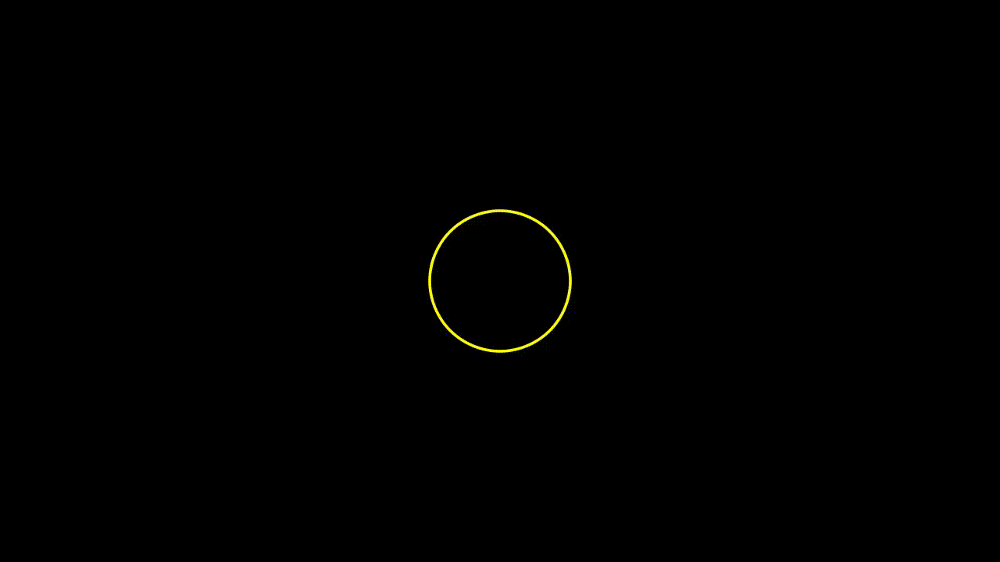

# manim_examples


## Example: 



## Run 
`python -m manim basic.py -pl`


## Code:
```python

from manimlib.imports import *

class Shapes(Scene):
    def construct(self):

        circle = Circle(color=YELLOW)
        square = Square(color=DARK_BLUE)
        square.surround(circle)
        text = Text("Mert Cobanov")
        text2 = Text("Deep Learning Türkiye")

        rectangle = Rectangle(height=2, width=3, color=RED)

        #Showing animation
        self.add(circle)
        self.play(FadeIn(square))
        self.play(Transform(square, rectangle))
        self.play(FadeOut(circle))
        self.play(ReplacementTransform(square, text))
        self.wait(0.5)
        self.play(ReplacementTransform(text, text2))
        self.wait(1)

```

### Video to gif 

`ffmpeg -y -i Shapes.mp4 -r 31 Shapes.gif`