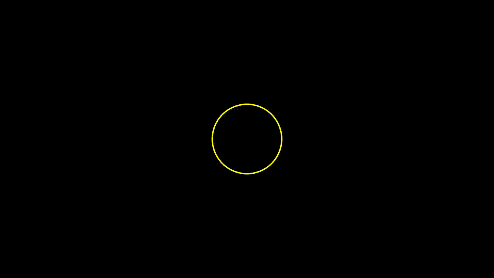
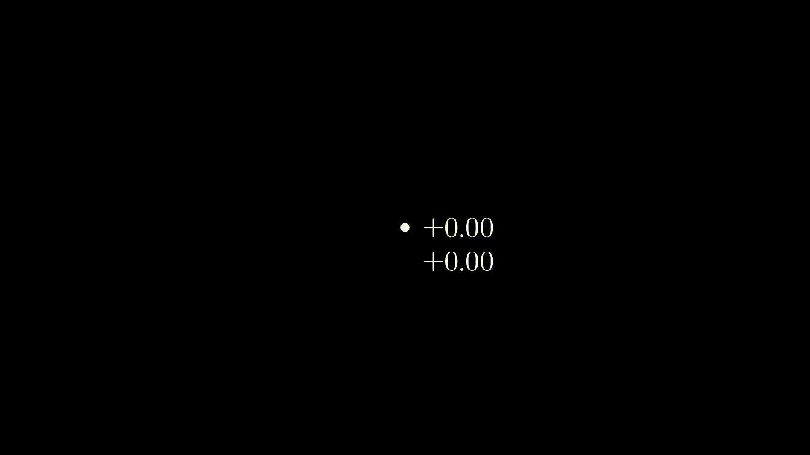

# Manim Examples
Bu repo [3Blue1Brown](https://www.youtube.com/3Blue1Brown) YouTube kanalında kullanılan harika animasyonların nasıl yapıldığıyla alakalı kodlar içermektedir.

Burada yapılan tüm çalışmalar için [manim](https://github.com/3b1b/manim) reposunu ziyaret edebilirsiniz. Dökümantasyon ve kurulum yönergeleri adrestedir.

[Mert Cobanov](https://www.youtube.com/MertCobanov) isimli YouTube kanalımda yakında animasyonları nasıl Python ile yazabileceğinizi anlatacağım bir eğitim serisi hazırlayacağım!

## Example: 

## Note:
Maalesef halen stable ve kolay kurulumlu bir kütüphane değil, birçok eksiği ve halledilmesi gereken problemi var. Dökümantasyonu tamamlanmış değil bu yüzden kodları okumanız gereken durumlar olabilir. Reddit ve GitHub'da komüniteyi takip edebilirsiniz. 

## Run
`python -m manim basic.py -pl`

## Projects:
See other projects in [Projects](https://github.com/cobanov/manim_examples/tree/master/projects) folder.

     

### Video to gif 

`ffmpeg -y -i input.mp4 -r 31 output.gif`
