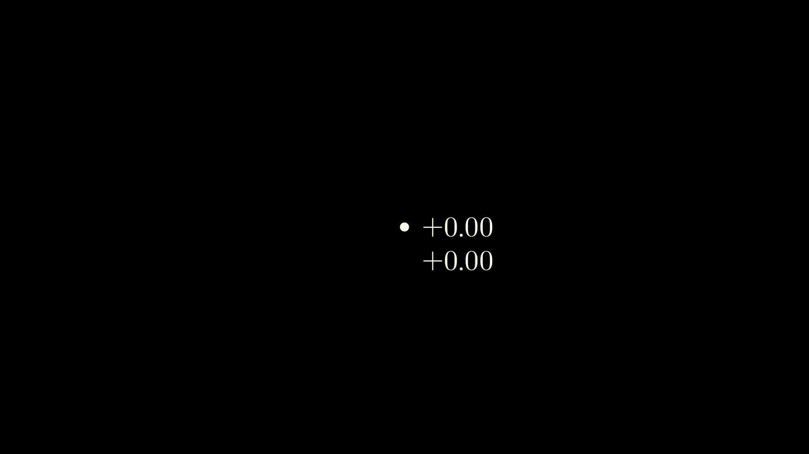

# Projects


## 1. Welcome 


```python
from manimlib.imports import *


class MoveText(Scene):
	def construct(self):

		circle = Circle(color=BLUE)
		circle.move_to(0.5*UP)
		circle.scale(1.7)

		circle2 = Circle(radius=1, color=BLUE)
		circle2.move_to(0.5*UP)
		circle2.scale(1)
		
		text = TextMobject("Mert Cobanov")
		text.scale(0.7)
		text.to_corner(DR)

		text2 = TextMobject("Data Science")
		text2.scale(2)
		text2.move_to(2*DOWN)
		
		jf = ImageMobject("C:\\manim\\assets\\jf.png")
		jf.scale(1.7)
		jf.move_to(UP)

		# michel = ImageMobject("C:\\manim\\assets\\michel.png")
		# michel.scale(1.7)
		# michel.move_to(UP)

		self.play(Write(circle), FadeIn(jf), Write(text2), Write(text),  run_time=2)
		self.play(FadeOut(jf),FadeOut(text),FadeOut(text2))
		self.play(ReplacementTransform(circle, circle2), run_time=0.7)
		
		self.wait()
```


## 2.Graphing


```python
from manimlib.imports import *
import math

## Bu proje https://github.com/malhotra5/Manim-Tutorial adresinden alınmıştır.
## This project is forked from https://github.com/malhotra5/Manim-Tutorial


class Graphing(GraphScene):
    CONFIG = {
        "x_min": -5,
        "x_max": 5,
        "y_min": -4,
        "y_max": 4,
        "graph_origin": ORIGIN,
        "function_color": WHITE,
        "axes_color": BLUE
    }

    def construct(self):
        #Make graph
        self.setup_axes(animate=True)
        func_graph=self.get_graph(self.func_to_graph,self.function_color)
        graph_lab = self.get_graph_label(func_graph, label = "x^{2}")

        func_graph_2=self.get_graph(self.func_to_graph_2,self.function_color)
        graph_lab_2 = self.get_graph_label(func_graph_2, label = "x^{3}")

        vert_line = self.get_vertical_line_to_graph(1,func_graph,color=YELLOW)

        x = self.coords_to_point(1, self.func_to_graph(1))
        y = self.coords_to_point(0, self.func_to_graph(1))
        horz_line = Line(x,y, color=YELLOW)

        point = Dot(self.coords_to_point(1,self.func_to_graph(1)))

        #Display graph
        self.play(ShowCreation(func_graph), Write(graph_lab))
        self.wait(1)
        self.play(ShowCreation(vert_line))
        self.play(ShowCreation(horz_line))
        self.add(point)
        self.wait(1)
        self.play(Transform(func_graph, func_graph_2), Transform(graph_lab, graph_lab_2))
        self.wait(2)


    def func_to_graph(self, x):
        return (x**2)

    def func_to_graph_2(self, x):
        return(x**3)
```
## 3. Updater Func



```python

from manimlib.imports import *

class UpdaterFunc(Scene):

    def construct(self):

        dot = Dot()
        number_x = DecimalNumber( include_sign=True).next_to(dot)
        number_y = DecimalNumber( include_sign=True).next_to(number_x, DOWN)

        def update_number_x(obj):
            obj.next_to(dot)
            
            obj.set_value(dot.get_center()[0])

        def update_number_y(obj):
            obj.next_to(dot)
            obj.next_to(number_x,DOWN)
            obj.set_value(dot.get_center()[1])

        number_x.add_updater(update_number_x)
        number_y.add_updater(update_number_y)

        self.add(dot, number_x, number_y)
        self.play(dot.shift, RIGHT, DOWN, run_time=2)
        self.play(Rotate(dot), about_point=ORIGIN, run_time=2)

        self.wait()

```


## 4. Basic


```python
from manimlib.imports import *

class Shapes(Scene):
    def construct(self):

        circle = Circle(color=YELLOW)
        square = Square(color=DARK_BLUE)
        square.surround(circle)
        text = Text("Mert Cobanov")
        text2 = Text("Deep Learning Türkiye")

        rectangle = Rectangle(height=2, width=3, color=RED)

        #Showing animation
        self.add(circle)
        self.play(FadeIn(square))
        self.play(Transform(square, rectangle))
        self.play(FadeOut(circle))
        self.play(ReplacementTransform(square, text))
        self.wait(0.5)
        self.play(ReplacementTransform(text, text2))
        self.wait(1)

```